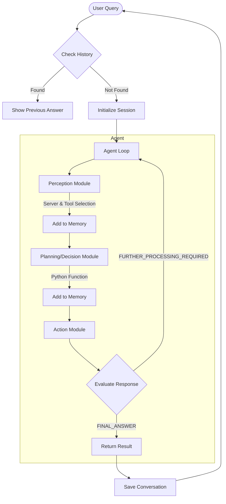

# Cortex-R Agent

An intelligent agent framework capable of reasoning, memory, and multi-step task execution through a modular tool-based architecture.

## Overview

Cortex-R is an advanced AI agent system that processes user queries through a perception-planning-action loop. The agent is designed to:

1. Remember past conversations and provide answers from history when available
2. Use a variety of tools to solve complex problems step-by-step
3. Apply intelligent heuristics to sanitize inputs and improve outputs
4. Execute Python code dynamically to solve user queries

## Architecture

The agent operates using a perception-planning-action loop with memory capabilities:



### Core Components

1. **Agent Loop** (`core/loop.py`): Orchestrates the overall process flow
2. **Perception Module** (`modules/perception.py`): Analyzes user input to determine intent and select appropriate tools
3. **Decision Module** (`modules/decision.py`): Generates a plan as executable Python code
4. **Action Module** (`modules/action.py`): Executes the plan in a controlled sandbox environment
5. **Memory System** (`modules/memory.py`): Stores conversation history and session context
6. **Input/Output Heuristics** (`core/heuristics.py`): Sanitizes inputs and improves outputs

## Key Features

### 1. Historical Conversation Memory

The agent stores previous conversations in `historical_conversation_store.json`, enabling it to:
- Retrieve answers for similar questions without reprocessing
- Offer users the choice between cached answers and fresh processing
- Build knowledge over time through interaction

### 2. Intelligent Heuristics

The agent applies 10 heuristic rules to improve input and output quality:

**Input Heuristics:**
- Length validation to prevent token overflow
- Banned word filtering for safety
- Sensitive information redaction (PII, credentials)
- Query normalization for better history matching
- Mathematical expression detection and formatting

**Output Heuristics:**
- Function format validation to ensure proper `solve()` structure
- Code block extraction from markdown responses
- Automatic import completion
- Return statement format validation
- Await call checking for async calls

### 3. Optimized Decision Prompt

The system uses a carefully optimized decision prompt (~300 words) that instructs the LLM to generate executable Python functions while maintaining high quality responses.

### 4. Multi-Tool Integration

The agent connects to multiple MCP (Modular Capability Provider) servers, each offering specialized tools:
- Mathematical operations
- Document search and extraction
- Web search capabilities
- Memory and history functions

## Usage

### Running the Agent

```bash
python agent.py
```

Follow the interactive prompts to provide queries. The agent will:
1. Check if a similar query has been answered before
2. If yes, offer to show the previous answer or compute a fresh one
3. If no, run through the perception-planning-action loop to solve the query

### Example Interactions

When you start the agent, you'll see:

```
🧠 Cortex-R Agent Ready
🧑 What do you want to solve today? →
```

You can enter queries like:
- "What is the relationship between Gensol and Go-Auto?"
- "Calculate the sum of exponentials of ASCII values in 'INDIA'"
- "Summarize this webpage: https://example.com"

The agent will process your query, showing the steps it's taking, and ultimately provide a final answer.

## Project Structure

```
├── agent.py                   # Main entry point
├── config/
│   ├── models.json            # Model configurations
│   └── profiles.yaml          # Agent profiles and MCP server configurations
├── core/
│   ├── context.py             # Context management
│   ├── heuristics.py          # Input/output validation rules
│   ├── loop.py                # Main agent loop
│   ├── session.py             # Session handling
│   └── strategy.py            # Planning strategies
├── documents/                 # Document storage for knowledge base
│   ├── images/                # Image files
│   ├── *.pdf                  # PDF documents
│   ├── *.md                   # Markdown files
│   ├── *.txt                  # Text files
│   └── *.docx                 # Word documents
├── faiss_index/               # Vector database for document search
│   ├── doc_index_cache.json   # Document index cache
│   ├── index.bin              # FAISS binary index
│   └── metadata.json          # Index metadata
├── historical_conversation_store.json  # Conversation memory
├── mcp_server_1.py            # MCP server implementation 1
├── mcp_server_2.py            # MCP server implementation 2 
├── mcp_server_3.py            # MCP server implementation 3
├── mcp_server_check.py        # MCP server health check
├── memory/                    # Session memory storage
│   └── [date]/[session]/      # Session-specific memory organized by date
├── models.py                  # Data models and schemas
├── modules/
│   ├── action.py              # Action execution
│   ├── decision.py            # Plan generation
│   ├── mcp_server_memory.py   # Memory server implementation
│   ├── memory.py              # Memory management
│   ├── model_manager.py       # LLM interface
│   ├── perception.py          # Input analysis
│   └── tools.py               # Tool utilities
└── prompts/                   # System prompts
    ├── decision_prompt.txt    # Standard decision prompt
    ├── decision_prompt_conservative.txt  # Conservative decision prompt
    ├── decision_prompt_exploratory_parallel.txt    # Parallel exploration prompt
    ├── decision_prompt_exploratory_sequential.txt  # Sequential exploration prompt
    ├── decision_prompt_new.txt           # Updated decision prompt
    └── perception_prompt.txt             # Perception system prompt
```

## Acknowledgments

This agent framework builds upon several key architectural patterns in AI agent systems, combining:
- Tool-based planning frameworks
- Memory and conversation history
- Input/output validation heuristics
- Dynamic Python execution in a sandbox environment 